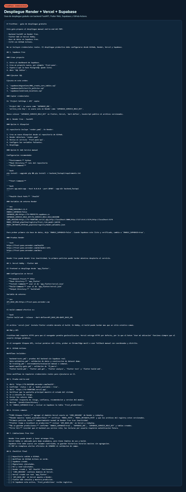
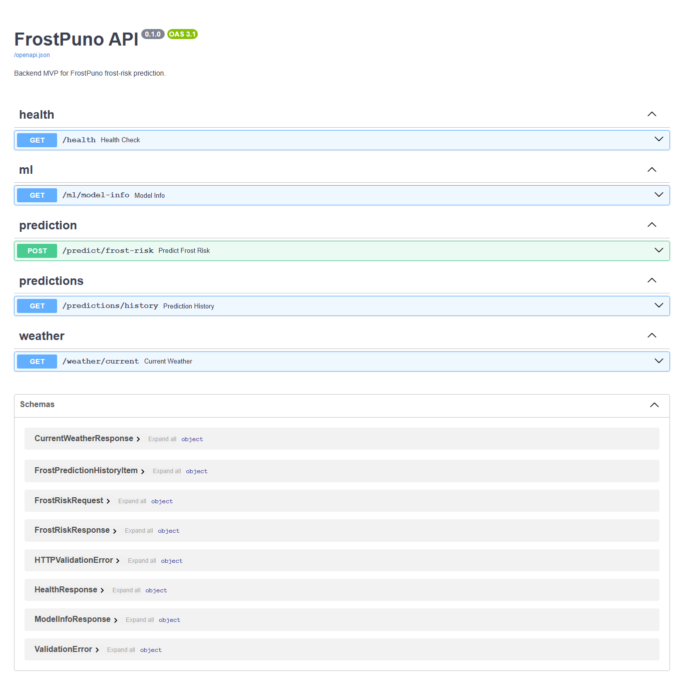
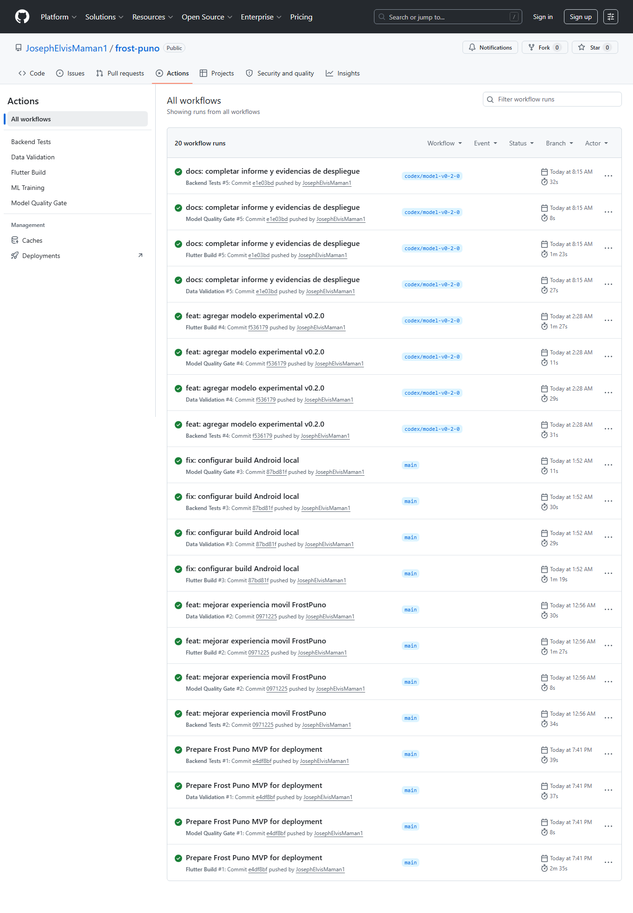
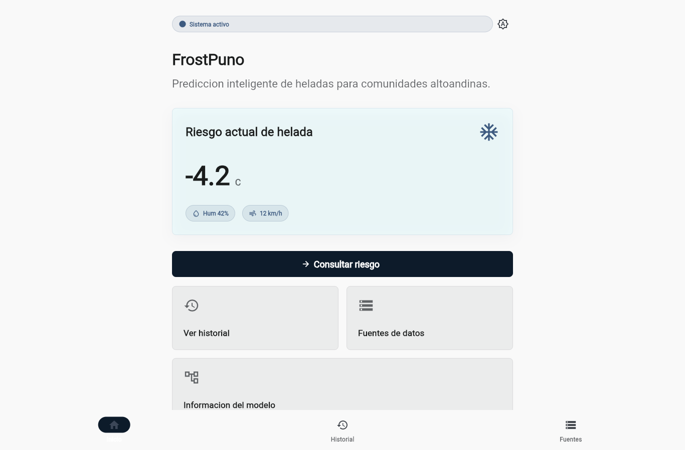
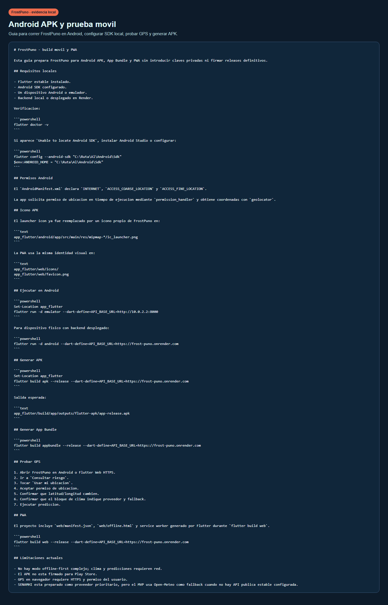
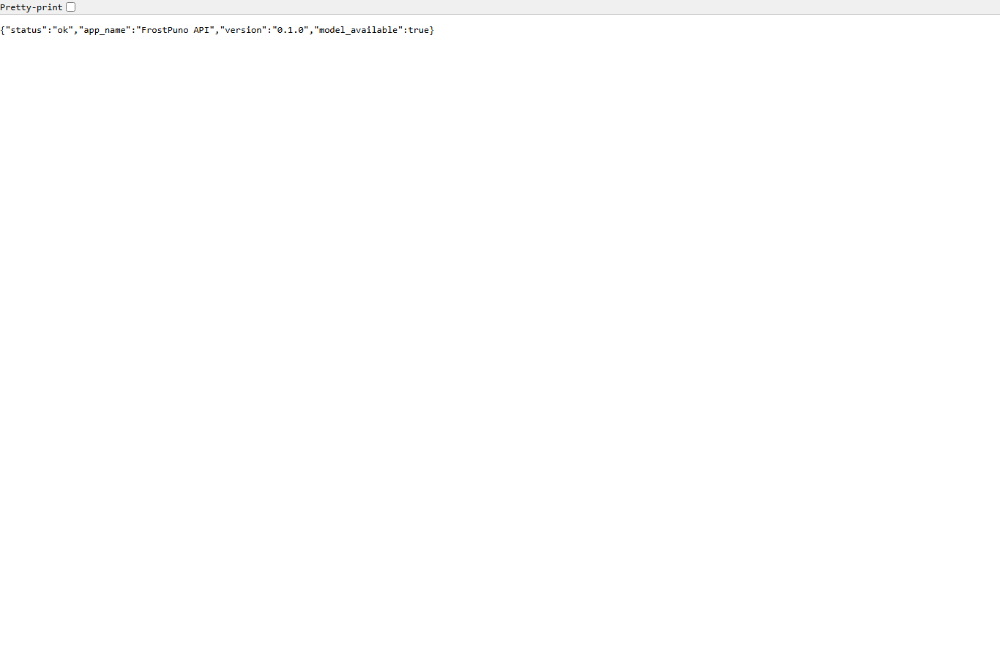
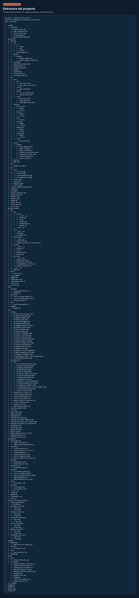
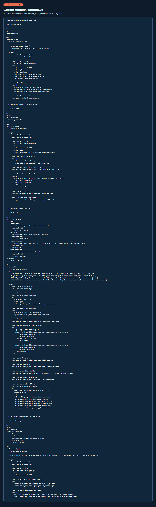

# Informe Técnico — FrostPuno
## Curso: Computación Paralela y Distribuida

**Sistema distribuido para predicción de heladas y apoyo a la producción de chuño en el altiplano de Puno.**

### Integrantes
- Mamani Mendoza, Joseph Elvis
- Lipe Machaca, Juan Artemio
- Ticona Erquinigo, Jhoel Yovani
- Tapara Ccahuana, Paul Renmis

**Producto en producción:**
- App web (Flutter): https://frost-puno.vercel.app
- API (FastAPI): https://frost-puno.onrender.com — documentación en `/docs`
- APK Android: build release de Flutter (`app-release.apk`, 47 MB)
- Repositorio: https://github.com/JosephElvisMaman1/frost-puno

---

## 1. Introducción y objetivo

FrostPuno es una aplicación con componentes inteligentes (modelo de clustering K-Means)
desplegada en producción. Desde la óptica de **Computación Paralela y Distribuida**, el
sistema es relevante por tres razones: (1) su **cómputo se paraleliza** en la ingesta de
datos climáticos, (2) su **arquitectura está físicamente distribuida** en servicios
independientes desplegados en distintos proveedores, y (3) su **mantenimiento e
integración continua** se ejecuta como **jobs paralelos** en la nube.

Este informe documenta esos aspectos para un equipo de TI que se encargue del
mantenimiento del sistema.

## 2. Arquitectura distribuida

El sistema separa responsabilidades en servicios autónomos que se comunican por HTTP/REST,
cada uno desplegado en una plataforma distinta (distribución real, no monolito):

```
   ┌────────────────────┐        HTTPS/REST        ┌─────────────────────┐
   │  Cliente Flutter    │  ───────────────────▶   │   API FastAPI        │
   │  Web (Vercel)       │  ◀───────────────────   │   (Render)           │
   │  + APK Android       │       JSON              │   modelo + lógica    │
   └────────────────────┘                          └─────────┬───────────┘
                                                              │
                              ┌───────────────────────────────┼───────────────┐
                              ▼                                ▼               ▼
                      ┌───────────────┐              ┌──────────────┐  ┌──────────────┐
                      │ Open-Meteo API │              │  Supabase     │  │  Registry de  │
                      │ (clima externo)│              │  (PostgreSQL) │  │  modelos ML   │
                      └───────────────┘              └──────────────┘  └──────────────┘
```

| Nodo | Plataforma | Rol | Escala independiente |
|---|---|---|---|
| Cliente Flutter | Vercel (Web) + APK | Presentación, GPS, gráficos | CDN global |
| API FastAPI | Render | Inferencia, alertas, chuño, histórico | Workers Uvicorn |
| Base de datos | Supabase (PostgreSQL) | Persistencia de predicciones | Gestionada |
| Clima | Open-Meteo | Fuente de datos climáticos | Externa |

**Desacoplamiento:** el cliente sólo conoce `API_BASE_URL` (inyectado por
`--dart-define`); el backend sólo expone contratos REST estables. Cada capa
(`api/routes` → `services` → `repositories`) puede escalarse o reemplazarse sin tocar las
demás. La clave `SUPABASE_SERVICE_ROLE_KEY` vive únicamente en el backend, nunca en el
cliente.



## 3. Paralelismo en la ingesta de datos (cómputo paralelo)

La recolección de clima histórico para los **13 distritos** de Puno se realiza en
**paralelo** con un pool de hilos (`ThreadPoolExecutor`), en lugar de secuencialmente.
Cada distrito es una tarea independiente (I/O-bound: petición HTTP a Open-Meteo), ideal
para paralelismo por hilos.

Código (`ml_pipeline/data_ingestion/ingest_weather_open_meteo.py`):

```python
with ThreadPoolExecutor(max_workers=max_workers) as executor:
    futures = {
        executor.submit(fetch_weather_for_location, record, start_date, end_date): record
        for record in records
    }
    for future in as_completed(futures):        # recolección conforme terminan
        record = futures[future]
        try:
            frames.append(future.result())
        except Exception as exc:                # aislamiento de fallos por distrito
            failures.append(f"{record['ubigeo']} {record['distrito']}: {exc}")
```

**Propiedades paralelas/distribuidas relevantes:**
- **Fan-out / fan-in:** se lanzan N tareas (`submit`) y se recolectan con `as_completed`
  (patrón productor-consumidor), sin esperar el orden de emisión.
- **Aislamiento de fallos:** si un distrito falla, los demás continúan; el fallo se
  registra por ubicación (tolerancia parcial a fallos).
- **Grado de paralelismo configurable:** `--max-workers` (por defecto 4) ajusta el
  ancho del pool según CPU/red.
- **Speedup:** al ser I/O-bound (latencia de red dominante), el tiempo total tiende a
  `≈ tiempo_de_una_petición` en vez de `N × tiempo`, acercándose al límite de Amdahl para
  la fracción paralelizable.

## 4. Concurrencia y eficiencia en el backend

- **Servidor concurrente:** el backend corre sobre **Uvicorn** (`uvicorn app.main:app`),
  servidor ASGI que atiende múltiples peticiones concurrentes; Render fija
  `WEB_CONCURRENCY` según CPU del contenedor.
- **Caché en memoria por coordenada:** `HybridWeatherProvider` cachea el clima por
  `(lat, lon)` con TTL, evitando golpear Open-Meteo en cada request (reduce latencia y
  carga sobre el servicio externo).
- **Singletons con `@lru_cache`:** el registry del modelo, el servicio de predicción y el
  proveedor de clima se instancian una sola vez por proceso (`model_registry.py`,
  `prediction_service.py`, `weather.py`), evitando recargar el modelo `.joblib` en cada
  petición.
- **Degradación controlada:** `HybridWeatherProvider` intenta SENAMHI y cae a Open-Meteo;
  expone `fallback_used` y `source_priority` para que el cliente muestre el estado.

## 5. Distribución del cómputo de Machine Learning

El sistema separa el cómputo pesado (offline) del cómputo de baja latencia (online),
patrón típico de sistemas distribuidos de ML:

- **Entrenamiento (offline, batch):** `ml_pipeline/clustering/train_clusters.py` entrena
  K-Means, selecciona `k` por silhouette y **serializa** el artefacto a un *registry*
  (`frost_cluster_model.joblib` + `cluster_metadata.json`).
- **Inferencia (online, tiempo real):** el backend **carga ese mismo artefacto** y sólo
  asigna el vector de clima al centroide más cercano — operación O(k) muy barata.
- **Contrato de features** en el metadata: desacopla el pipeline de entrenamiento del
  servicio de inferencia. Reentrenar no requiere modificar el backend.



## 6. Integración continua como jobs paralelos (mantenimiento automatizado)

El mantenimiento del sistema —incluido el del componente inteligente— está automatizado
en **GitHub Actions** con **5 workflows independientes** que se ejecutan en **paralelo**
en runners separados ante cada push:

| Workflow | Función |
|---|---|
| `ml-training.yml` | Reentrena el modelo K-Means y publica artefactos |
| `model-quality-gate.yml` | Bloquea modelos con silhouette < 0.35 (quality gate) |
| `backend-tests.yml` | Ejecuta las 12 pruebas de la API (sin Supabase) |
| `data-validation.yml` | Valida datasets y ubicaciones |
| `flutter-build.yml` | `analyze` + `test` + build web de Flutter |

Cada workflow es un **job aislado** con su propio entorno; corren concurrentemente y no
se bloquean entre sí. El *quality gate* actúa como barrera: si el modelo reentrenado no
supera el umbral de silhouette, la integración se detiene (mantenimiento seguro del
elemento inteligente).



## 7. Despliegue en producción (puesta en marcha)

- **Backend (Render):** definido en `render.yaml` (Infra as Code). `autoDeploy: true` →
  cada merge a `main` redepliega automáticamente. Health check en `/health`. Comando:
  `uvicorn app.main:app --host 0.0.0.0 --port $PORT --app-dir backend_fastapi`.
- **Frontend web (Vercel):** `app_flutter/vercel.json`, auto-deploy desde `main`, servido
  por CDN global (`frost-puno.vercel.app`).
- **APK Android (Flutter):** build release nativo, apuntando al backend de producción:
  ```bash
  flutter build apk --release --dart-define=API_BASE_URL=https://frost-puno.onrender.com
  ```
  Genera `app-release.apk` (47 MB). La app corre offline-tolerante (PWA en web,
  notificaciones locales nativas en Android) y consume la misma API distribuida.
- **Persistencia (Supabase):** PostgreSQL gestionado, activable por `ENABLE_SUPABASE`.





## 8. Escalabilidad hacia microservicios

El diseño modular permite evolucionar cada capa a un microservicio independiente:
- El **proveedor de clima**, el **servicio de predicción** y la **persistencia** ya están
  separados por interfaces; podrían desplegarse como servicios distintos detrás de un
  gateway.
- La **ingesta paralela** puede escalarse a un job distribuido (más workers o varios
  nodos) sin tocar el resto.
- El **cliente** (Vercel CDN) escala horizontalmente por naturaleza.

## 9. Pruebas de funcionamiento (evidencias)

- **Backend:** `pytest backend_fastapi/tests` → **12 pruebas verdes**.
- **Modelo:** quality gate silhouette **0.419 ≥ 0.35** → PASSED.
- **Flutter:** `analyze` + `test` + `build web` verdes; **APK release compila** (47 MB).
- **Producción:** `GET /ml/model-info` responde `KMeans v1.0.0-clustering`; `/alerts/today`
  responde con bloques de riesgo, ganado y anomalía.




## 10. Conclusiones y limitaciones

- El sistema demuestra **paralelismo de cómputo** (ingesta multihilo), **distribución
  física** (Vercel/Render/Supabase/Open-Meteo) y **automatización paralela** del
  mantenimiento (5 workflows + quality gate).
- **Limitaciones:** SENAMHI no expone API pública estable (Open-Meteo es la fuente
  operativa real); Render Free tiene arranque en frío; los umbrales de dominio (chuño,
  ganado) son diseño MVP documentado. Ninguna afecta la validez de la arquitectura
  distribuida ni del paralelismo demostrado.

---

> **Nota sobre capturas:** las imágenes referenciadas provienen de `docs/capturas/`.
> Para la entrega final conviene refrescar: (a) la app web actual en Vercel,
> (b) `/ml/model-info` mostrando silhouette 0.419, y (c) la pestaña Actions con los 5
> jobs en verde tras el último push.
