# Universidad Nacional del Altiplano

## Facultad de Ingeniería Mecánica Eléctrica, Electrónica y Sistemas

## Escuela Profesional de Ingeniería de Sistemas

### Proyecto

# FrostPuno

## Sistema inteligente distribuido para predicción de heladas y apoyo a la producción de chuño en comunidades altoandinas de Puno mediante aprendizaje supervisado y datos abiertos

**Cursos:** Computación Paralela y Distribuida / Aprendizaje de Máquina  
**Autor:** Joseph Elvis Mamani Mendoza  
**Docente:** [Completar]  
**Lugar:** Puno, Perú  
**Año:** 2026

---

## 1. Carátula

**Universidad:** Universidad Nacional del Altiplano  
**Facultad:** Facultad de Ingeniería Mecánica Eléctrica, Electrónica y Sistemas  
**Escuela Profesional:** Ingeniería de Sistemas  
**Proyecto:** FrostPuno
**Cursos:** Computación Paralela y Distribuida / Aprendizaje de Máquina  
**Autor:** Joseph Elvis Mamani Mendoza  
**Docente:** [Completar]  
**Lugar:** Puno, Perú  
**Año:** 2026

---

## 2. Resumen

FrostPuno es un sistema inteligente orientado a la predicción del riesgo de heladas en comunidades altoandinas de la región Puno, con énfasis en el apoyo a productores agrícolas y productores de chuño. El proyecto aborda una problemática regional relevante: la exposición de cultivos, ganado y actividades productivas tradicionales a descensos críticos de temperatura, especialmente en zonas de alta altitud donde las decisiones suelen basarse en experiencia empírica y no siempre en información climática integrada.

La solución implementada corresponde a un Producto Mínimo Viable (MVP) que integra datos abiertos meteorológicos, territoriales y agropecuarios. Open-Meteo se utiliza como fuente climática principal para obtener variables horarias por coordenadas; INEI se emplea como fuente territorial y censal mediante una semilla curada documentada para distritos de Puno; SENAMHI se considera como fuente oficial peruana para validación climática en una segunda fase; y MIDAGRI/SIEA se plantea como fuente complementaria para enriquecer el contexto agrícola.

Desde el enfoque de Aprendizaje de Máquina, el sistema construye un dataset tabular, genera variables predictoras, etiqueta inicialmente el riesgo de helada mediante reglas térmicas y entrena modelos supervisados de clasificación multiclase. Se comparan LogisticRegression, DecisionTreeClassifier y RandomForestClassifier, seleccionando RandomForestClassifier como modelo principal. La métrica principal es f1-score macro, adecuada para un problema con tres clases y posible desbalance.

Desde Computación Paralela y Distribuida, el proyecto evidencia procesamiento concurrente por distritos durante la ingesta climática, separación modular de responsabilidades, backend FastAPI, base de datos Supabase preparada, cliente Flutter y flujos CI/CD con GitHub Actions. El sistema no pretende reemplazar alertas oficiales, sino demostrar una arquitectura académica funcional, extensible y verificable para predicción de riesgo agroclimático.

---

## 3. Introducción

La región Puno presenta condiciones climáticas particulares debido a su altitud, geografía altoandina y variabilidad térmica. Las heladas constituyen un fenómeno recurrente que afecta a comunidades rurales, productores de papa, ganaderos y familias dedicadas a la producción tradicional de chuño. En este contexto, la anticipación del riesgo de helada es un factor importante para la toma de decisiones agrícolas, la protección de cultivos sensibles y la planificación de actividades productivas.

Tradicionalmente, muchos productores interpretan señales del entorno y toman decisiones a partir de conocimiento empírico acumulado. Dicho conocimiento es valioso, pero puede fortalecerse mediante herramientas computacionales que integren datos meteorológicos, ubicación geográfica, altitud, información territorial y aprendizaje automático.

FrostPuno surge como una propuesta académica y tecnológica para demostrar que es posible construir un sistema distribuido, modular y basado en datos abiertos capaz de estimar el riesgo de helada en niveles bajo, medio y alto. El proyecto combina una aplicación Flutter, un backend FastAPI, un pipeline de Machine Learning en Python con Scikit-learn, una base de datos Supabase preparada para persistencia y workflows de GitHub Actions para validación continua.

El propósito del MVP no es emitir alertas oficiales ni reemplazar a instituciones especializadas como SENAMHI, sino construir una base tecnológica verificable para investigación, exposición universitaria y mejora progresiva del modelo.

---

## 4. Planteamiento del problema

### 4.1 Problema general

¿Cómo desarrollar un sistema inteligente distribuido que integre datos abiertos meteorológicos, territoriales y agropecuarios para estimar el riesgo de heladas en comunidades altoandinas de Puno y apoyar la toma de decisiones relacionadas con cultivos y producción de chuño?

### 4.2 Problemas específicos

1. ¿Cómo integrar datos climáticos por coordenadas con información territorial y censal de distritos de Puno?
2. ¿Cómo construir un dataset inicial para clasificar el riesgo de helada en bajo, medio y alto?
3. ¿Qué modelo supervisado tabular resulta adecuado para un MVP académico con recursos computacionales limitados?
4. ¿Cómo evidenciar procesamiento paralelo y arquitectura distribuida sin desplegar microservicios costosos?
5. ¿Cómo exponer predicciones mediante una API modular consumida por una aplicación Flutter?
6. ¿Cómo registrar, evaluar y gobernar versiones del modelo mediante CI/CD y quality gates?

---

## 5. Justificación

### 5.1 Justificación social

Las heladas afectan directamente a familias rurales, agricultores, ganaderos y productores de chuño. Una herramienta que permita consultar el riesgo de helada de forma sencilla puede contribuir a mejorar la planificación de labores agrícolas y la protección de cultivos sensibles. Aunque el MVP no reemplaza sistemas oficiales, sirve como base para acercar información técnica a usuarios no especializados.

### 5.2 Justificación tecnológica

El proyecto demuestra la integración de tecnologías modernas: Flutter para frontend móvil/web, FastAPI para backend, Scikit-learn para aprendizaje supervisado, Supabase para persistencia y GitHub Actions para automatización. La arquitectura modular permite escalar hacia servicios especializados en fases posteriores.

### 5.3 Justificación académica

FrostPuno articula dos áreas centrales de la Ingeniería de Sistemas: Computación Paralela y Distribuida, y Aprendizaje de Máquina. El sistema permite demostrar ingesta concurrente, separación de responsabilidades, validación automatizada, entrenamiento de modelos, evaluación de métricas y ciclo de vida ML.

### 5.4 Justificación regional

Puno requiere soluciones contextualizadas a su geografía, altitud y actividades productivas. El uso de datos abiertos y variables territoriales facilita construir una herramienta vinculada a la realidad regional, especialmente para distritos y centros poblados altoandinos.

---

## 6. Objetivos

### 6.1 Objetivo general

Desarrollar un sistema inteligente distribuido para predecir el riesgo de heladas en comunidades altoandinas de Puno mediante aprendizaje supervisado, integración de datos abiertos y una arquitectura modular orientada a servicios.

### 6.2 Objetivos específicos

1. Integrar datos climáticos desde Open-Meteo con datos territoriales compatibles con INEI.
2. Construir un dataset inicial con variables meteorológicas, geográficas y poblacionales.
3. Entrenar y comparar modelos supervisados para clasificar el riesgo de helada.
4. Implementar un backend FastAPI modular con endpoints de predicción e información del modelo.
5. Preparar una estructura Supabase con tablas, políticas RLS y repositorio opcional.
6. Desarrollar una aplicación Flutter modular inspirada en el diseño visual de Stitch.
7. Implementar workflows de CI/CD para pruebas, validación de datos, entrenamiento y quality gate.
8. Documentar limitaciones, resultados y fases futuras del sistema.

---

## 7. Alcance del proyecto

El alcance actual corresponde a un MVP académico funcional. Incluye:

- Pipeline ML para ingesta, features, validación, entrenamiento, evaluación y registry.
- Uso de Open-Meteo como fuente climática principal.
- Semilla territorial curada compatible con estructura INEI para distritos seleccionados de Puno.
- Modelo RandomForestClassifier registrado.
- Backend FastAPI con endpoints mínimos funcionales.
- Estructura Supabase con migraciones, seed y políticas RLS.
- Aplicación Flutter Web/móvil con pantallas principales.
- CI/CD con GitHub Actions para validación del backend, datos y modelo.

Queda fuera del MVP:

- Integración completa automatizada de INEI EstaDist, Microdatos o CENAGRO.
- Validación oficial completa con estaciones SENAMHI.
- Alertas push reales.
- Mapa interactivo.
- Modo offline.
- Despliegue productivo completo.
- Validación con productores en campo.

---

## 8. Marco teórico

### 8.1 Heladas en comunidades altoandinas

Las heladas ocurren cuando la temperatura desciende hasta niveles que pueden afectar tejidos vegetales, agua superficial, suelos y actividades agropecuarias. En zonas altoandinas, la altitud, baja humedad nocturna, cielos despejados y vientos pueden intensificar el enfriamiento. En Puno, estos eventos tienen impacto sobre cultivos, pastos, animales y seguridad alimentaria.

### 8.2 Producción de chuño

El chuño es un producto tradicional obtenido mediante procesos de congelación y deshidratación de tubérculos, principalmente papa. Las bajas temperaturas nocturnas pueden ser favorables para su producción cuando se combinan con condiciones de baja precipitación y exposición adecuada. Por ello, un sistema que identifique condiciones de helada puede apoyar tanto la protección de cultivos como la planificación de producción de chuño.

### 8.3 Aprendizaje supervisado

El aprendizaje supervisado utiliza ejemplos etiquetados para entrenar modelos capaces de predecir una variable objetivo. En FrostPuno, la variable objetivo es `riesgo_helada`, con tres clases: bajo, medio y alto. Las etiquetas iniciales se generan mediante reglas basadas en temperatura mínima diaria y horas bajo cero.

### 8.4 Random Forest

Random Forest es un método de ensamble que combina múltiples árboles de decisión entrenados sobre subconjuntos de datos y variables. Su ventaja principal es que suele ofrecer buen desempeño en datos tabulares, tolerancia a relaciones no lineales y menor tendencia al sobreajuste respecto a un árbol individual. En el MVP se eligió por su equilibrio entre precisión, interpretabilidad práctica y costo computacional razonable.

### 8.5 Clasificación multiclase

La clasificación multiclase consiste en asignar cada registro a una de varias categorías posibles. En este caso, las clases son `bajo`, `medio` y `alto`. Se usa f1-score macro porque calcula el promedio del desempeño por clase sin ponderar por frecuencia, lo cual es útil cuando puede existir desbalance.

### 8.6 Computación paralela

La computación paralela permite ejecutar múltiples tareas al mismo tiempo para reducir tiempos de procesamiento. En FrostPuno se evidencia mediante la descarga concurrente de clima por distrito usando `max-workers`, lo que permite consultar Open-Meteo para varias ubicaciones de forma simultánea.

### 8.7 Sistemas distribuidos

Un sistema distribuido separa responsabilidades entre componentes que interactúan mediante interfaces. FrostPuno distribuye funciones entre app Flutter, backend FastAPI, pipeline ML, Supabase y GitHub Actions. Aunque el MVP usa un backend modular monolítico, su diseño facilita migrar a microservicios.

### 8.8 CI/CD

La integración y entrega continua permiten automatizar pruebas, validación, entrenamiento y control de calidad. En este proyecto, GitHub Actions valida backend, datos y modelos para reducir errores manuales y asegurar reproducibilidad.

### 8.9 Ciclo de vida de modelos ML

El ciclo de vida ML comprende ingesta de datos, preparación, entrenamiento, evaluación, registro, monitoreo y mejora continua. FrostPuno implementa una versión inicial de este ciclo mediante scripts de pipeline, registry y quality gate.

---

## 9. Fuentes de datos

### 9.1 Open-Meteo

Open-Meteo es la fuente climática principal del MVP. Permite obtener datos históricos por coordenadas mediante su Historical Weather API. En el pipeline se consultan variables horarias como temperatura, humedad relativa, sensación térmica, punto de rocío, precipitación, nubosidad y velocidad del viento.

### 9.2 INEI

INEI se usa como fuente territorial, censal y agropecuaria de referencia. En el MVP se utiliza `data/external/inei_puno_districts.csv`, una semilla curada inicial compatible con estructura distrital de INEI. Esta semilla no representa una extracción completa automática desde INEI; debe reemplazarse o validarse con exportaciones oficiales de EstaDist, CPV 2017, Microdatos o CENAGRO en fases futuras.

### 9.3 SENAMHI

SENAMHI se considera fuente oficial peruana para validación climática y fases futuras. Su información de estaciones, avisos meteorológicos y datos hidrometeorológicos permitiría contrastar las predicciones generadas por el modelo y mejorar las etiquetas iniciales.

### 9.4 MIDAGRI/SIEA

MIDAGRI/SIEA se plantea como fuente agrícola complementaria para incorporar producción, superficie, rendimiento y cultivos relevantes. En el MVP se documenta su uso futuro para enriquecer recomendaciones y ponderar exposición productiva.

### 9.5 Limitaciones del dataset inicial

El dataset inicial utiliza etiquetas derivadas de reglas térmicas. Esto permite entrenar un modelo base, pero no equivale a observaciones oficiales de daño agrícola. Asimismo, la semilla territorial debe ser reemplazada por datos oficiales completos antes de un uso productivo.

---

## 10. Arquitectura del sistema

FrostPuno se organiza en componentes independientes:

- **Flutter:** interfaz móvil/web para consulta, resultado, historial, fuentes y modelo.
- **FastAPI:** backend que expone endpoints REST, valida datos con Pydantic y ejecuta predicciones.
- **Supabase:** base de datos PostgreSQL preparada para persistir predicciones, ubicaciones, modelos y logs.
- **ML pipeline:** scripts Python para ingesta, features, entrenamiento, evaluación y registry.
- **GitHub Actions:** automatización de pruebas, validación de datos, entrenamiento y quality gate.

### 10.1 Flujo de datos

1. El pipeline ingiere ubicaciones y clima.
2. Se construye el dataset de entrenamiento.
3. Se entrena y registra el mejor modelo.
4. FastAPI carga el modelo desde el registry.
5. Flutter envía un JSON de consulta a FastAPI.
6. FastAPI predice el riesgo y devuelve recomendación.
7. Si Supabase está habilitado, se registra la predicción en `frost_predictions`.

### 10.2 Backend modular monolítico

Para el MVP se eligió un backend modular monolítico en lugar de microservicios reales porque:

- reduce complejidad de despliegue;
- evita costos de infraestructura;
- mantiene el proyecto ejecutable en una laptop;
- permite demostrar separación de responsabilidades mediante carpetas, servicios y repositorios;
- facilita migrar a microservicios si el sistema crece.

---

## 11. Computación Paralela y Distribuida

El proyecto evidencia conceptos de computación paralela y distribuida en distintos niveles:

### 11.1 Procesamiento por distritos y centros poblados

El diseño contempla procesar datos climáticos por distrito o centro poblado. En el MVP se trabaja con distritos seleccionados de Puno.

### 11.2 Uso de max-workers

El script `ingest_weather_open_meteo.py` permite configurar `--max-workers`, ejecutando múltiples solicitudes concurrentes hacia Open-Meteo. Esto reduce el tiempo de ingesta cuando se procesan varias ubicaciones.

### 11.3 Consultas concurrentes a Open-Meteo

Cada ubicación puede consultarse de forma independiente, lo cual se ajusta naturalmente a un patrón paralelo. Las respuestas se integran luego en un dataset común.

### 11.4 Jobs independientes en CI/CD

Los workflows de GitHub Actions separan responsabilidades:

- pruebas backend;
- validación de datos;
- entrenamiento ML;
- quality gate.

Esto representa una distribución lógica de tareas de mantenimiento del sistema.

### 11.5 Escalabilidad futura

En fases posteriores, los módulos podrían separarse en servicios independientes:

- servicio climático;
- servicio territorial;
- servicio ML;
- servicio de alertas;
- servicio de historial;
- servicio de entrenamiento.

---

## 12. Aprendizaje de Máquina

### 12.1 Tipo de problema

El problema se formula como clasificación supervisada multiclase. Cada registro representa condiciones climáticas y territoriales para una ubicación y tiempo específico.

### 12.2 Variable objetivo

La variable objetivo es:

```text
riesgo_helada
```

### 12.3 Clases

- `bajo`
- `medio`
- `alto`

### 12.4 Variables predictoras v0.1.0

La versión productiva `v0.1.0`, mantenida para compatibilidad con FastAPI, usa variables territoriales, climáticas y derivadas:

- latitud;
- longitud;
- altitud estimada;
- población total;
- población rural;
- porcentaje rural;
- temperatura;
- humedad relativa;
- sensación térmica;
- punto de rocío;
- precipitación;
- nubosidad;
- viento;
- mes;
- hora;
- temperatura mínima diaria;
- horas bajo cero.

Estas dos últimas variables explican el resultado perfecto de la evaluación inicial, porque también participan en la regla que genera la etiqueta `riesgo_helada`.

### 12.5 Variables predictoras v0.2.0 sin data leakage

Para mejorar la validez académica se creó una versión experimental `v0.2.0`, sin reemplazar producción. Esta versión elimina como features:

- `temperatura_minima_diaria`;
- `horas_bajo_cero`.

El nuevo dataset `data/processed/frost_training_dataset_v2.csv` conserva únicamente variables disponibles de forma honesta para una predicción operativa:

- latitud;
- longitud;
- altitud estimada;
- temperatura actual (`temperature_2m`);
- humedad relativa (`relative_humidity_2m`);
- sensación térmica (`apparent_temperature`);
- punto de rocío (`dew_point_2m`);
- viento (`wind_speed_10m`);
- nubosidad (`cloud_cover`);
- precipitación (`precipitation`);
- mes;
- hora.

### 12.6 Modelos comparados

En `v0.1.0` se compararon:

- LogisticRegression;
- DecisionTreeClassifier;
- RandomForestClassifier.

En `v0.2.0` se entrenó `RandomForestClassifier` como baseline versionado y se agregó `LogisticRegression` como comparación interna. El artefacto registrado de `v0.2.0` corresponde a Random Forest para mantener continuidad metodológica.

### 12.7 Métrica principal

La métrica principal fue f1-score macro. Esta métrica es adecuada porque el problema tiene tres clases y puede existir desbalance entre bajo, medio y alto.

### 12.8 Elección de Random Forest

RandomForestClassifier fue seleccionado como modelo principal porque:

- es adecuado para datos tabulares;
- captura relaciones no lineales;
- ofrece buen desempeño sin requerir modelos pesados;
- es eficiente para una laptop con 16 GB de RAM;
- mantiene una complejidad razonable para fines académicos.

### 12.9 Resultados obtenidos y lectura crítica

El modelo productivo registrado sigue siendo RandomForestClassifier versión `v0.1.0`. El quality gate fue aprobado con f1-score macro igual a `1.0000`. Esta cifra no debe interpretarse como predicción perfecta de heladas reales: indica que el modelo aprendió muy bien la regla interna usada para construir la etiqueta.

La versión experimental `v0.2.0` corrige este sesgo eliminando columnas filtradas y usando split por distrito. Sus métricas son más bajas, pero más honestas:

| Métrica | v0.1.0 | v0.2.0 |
|--------|--------|--------|
| Split | Aleatorio estratificado | Por distrito |
| Accuracy | 1.0000 | 0.5097 |
| Precision macro | 1.0000 | 0.4697 |
| Recall macro | 1.0000 | 0.4954 |
| F1 macro | 1.0000 | 0.4790 |

La matriz de confusión de `v0.2.0` evidencia errores reales de generalización:

| Real \ Predicho | bajo | medio | alto |
|-----------------|------|-------|------|
| bajo | 287 | 82 | 15 |
| medio | 79 | 330 | 191 |
| alto | 103 | 189 | 68 |

Esto permite discutir falsos positivos y falsos negativos. Por ejemplo, existen casos reales `alto` predichos como `medio` o `bajo`, lo que en un sistema productivo sería crítico y exigiría validación adicional con SENAMHI y observaciones de campo. Por esa razón `v0.2.0` no reemplaza al modelo activo: queda como versión experimental para validación académica.

---

## 13. Pipeline ML

El pipeline ML se organiza en las siguientes etapas:

### 13.1 Ingesta de ubicaciones

El script `ingest_locations.py` valida `data/external/inei_puno_districts.csv` y genera `data/processed/locations_puno.csv`.

### 13.2 Ingesta de clima

El script `ingest_weather_open_meteo.py` consulta Open-Meteo por coordenadas y guarda `data/raw/weather_open_meteo.csv`.

### 13.3 Construcción de features

El script `build_features.py` une ubicaciones y clima, calcula variables temporales y genera etiquetas de riesgo.

### 13.4 Validación de datos

El script `validate_dataset.py` verifica columnas requeridas, valores nulos críticos, clases esperadas y rangos climáticos.

### 13.5 Entrenamiento v0.1.0

El script `train_models.py` entrena y compara modelos. Usa `train_test_split` con `random_state` fijo.

### 13.6 Entrenamiento v0.2.0

El script `train_models_v2.py` entrena la versión experimental `v0.2.0` con dos estrategias de evaluación reproducibles:

- split por distrito, separando distritos completos entre entrenamiento y prueba;
- split por tiempo, usando fechas iniciales para train y fechas recientes para test cuando hay timestamp disponible.

El modelo registrado `v0.2.0` usa split por distrito. Los distritos de prueba son Ayaviri, Juli, Juliaca y Lampa, por lo que no se mezclan registros del mismo distrito entre train y test.

### 13.7 Evaluación

El script `evaluate_model.py` genera métricas y matriz de confusión.

Para `v0.2.0`, las métricas y matriz de confusión quedan guardadas en:

```text
ml_pipeline/evaluation/confusion_matrix_v0_2_0.csv
ml_pipeline/evaluation/metrics_comparison_v0_2_0.json
```

### 13.8 Registry

El modelo y metadata se guardan en:

```text
ml_pipeline/registry/frost_risk_model.joblib
ml_pipeline/registry/model_metadata.json
```

La versión experimental se guarda sin sobrescribir el modelo productivo:

```text
ml_pipeline/registry/frost_risk_model_v0_2_0.joblib
ml_pipeline/registry/model_metadata_v0_2_0.json
```

### 13.9 Quality gate

El script `check_model_quality.py` lee `f1_macro` desde metadata y falla si no supera el umbral mínimo.

---

## 14. Backend FastAPI

El backend FastAPI expone los siguientes endpoints:

### 14.1 GET /health

Permite verificar el estado del backend y disponibilidad del modelo registrado.

### 14.2 GET /ml/model-info

Devuelve información del modelo: nombre, versión, features, target, métricas, tamaño de dataset, fuentes y limitaciones.

### 14.3 POST /predict/frost-risk

Recibe un JSON con variables territoriales y climáticas. Valida la entrada con Pydantic, transforma el request en features, ejecuta el modelo y devuelve:

- nivel de riesgo;
- confianza;
- recomendación;
- condición para chuño;
- versión del modelo;
- fuentes de datos.

### 14.4 GET /predictions/history

Devuelve historial desde Supabase si está habilitado. Si Supabase no está configurado, usa fallback NoOp y retorna lista vacía.

### 14.5 Pydantic, errores, CORS y repositorios

FastAPI usa Pydantic para validar contratos de entrada y salida. El manejo de errores evita exponer detalles internos del modelo. Se configuró CORS para permitir consumo desde Flutter Web local. La persistencia usa un patrón de repositorio con dos implementaciones:

- `SupabasePredictionRepository`;
- `NoOpPredictionRepository`.

---

## 15. Base de datos Supabase

Supabase se preparó con migraciones SQL, seed y políticas RLS.

### 15.1 Tablas

- `users_profile`: perfiles de usuario.
- `inei_locations`: ubicaciones territoriales.
- `populated_centers`: centros poblados.
- `agricultural_context`: contexto agrícola.
- `weather_records`: registros meteorológicos.
- `frost_predictions`: predicciones generadas.
- `alerts`: alertas futuras.
- `model_versions`: versiones del modelo.
- `training_runs`: ejecuciones de entrenamiento.
- `data_sources_log`: trazabilidad de fuentes de datos.

### 15.2 Seguridad y RLS

Se habilita Row Level Security en tablas del esquema público. Las tablas territoriales pueden leerse públicamente. Las predicciones se insertan desde backend usando `service_role`, nunca desde Flutter. En el frontend no se almacenan credenciales de Supabase.

### 15.3 Service role

La clave `service_role` solo debe existir en el backend o en secretos seguros de infraestructura. No debe exponerse en Flutter, Flutter Web, repositorios ni variables públicas.

### 15.4 Feedback y observaciones para mejora supervisada

Se agregó una migración incremental:

```text
supabase/migrations/002_add_feedback_and_observations.sql
```

Esta migración prepara dos tablas:

- `prediction_feedback`: registra correcciones o confirmaciones de usuarios/productores sobre una predicción.
- `official_frost_observations`: registra observaciones oficiales o verificadas en campo, por ejemplo SENAMHI o campañas de validación.

Estas tablas no hacen que el modelo se entrene solo. Su objetivo es almacenar evidencia revisable para evaluar modelos candidatos, detectar falsos positivos/falsos negativos y decidir manualmente si una versión debe promoverse.

---

## 16. Aplicación Flutter

La app Flutter implementa una arquitectura modular por features:

- `home`;
- `prediction`;
- `history`;
- `data_sources`;
- `model_info`;
- `shell`.

### 16.1 Pantallas implementadas

- Home;
- PredictionForm;
- Result;
- History;
- DataSources;
- ModelInfo.

### 16.2 Consumo de API

Flutter consume únicamente FastAPI mediante `ApiClient` y `FrostApiService`. No se comunica directamente con Supabase.

### 16.3 Diseño inspirado en Stitch

El diseño toma como referencia el concepto visual `stitch_frost_puno_predictor`, usando una paleta con deep navy, ice blue, muted teal, soft white y amber para alertas.

### 16.4 Preparación para Web y móvil

La app fue creada para Android y Web. Usa `--dart-define=API_BASE_URL` para configurar el backend según entorno.

### 16.5 Icono y acabado móvil

El APK y la PWA usan un icono propio de FrostPuno con identidad visual altoandina/fría. Los assets se actualizaron en:

```text
app_flutter/android/app/src/main/res/mipmap-*/ic_launcher.png
app_flutter/web/icons/
app_flutter/web/favicon.png
```

La pantalla inicial también muestra una tarjeta de “mejora supervisada”, explicando que el sistema registra evidencia, evalúa contra observaciones y versiona modelos antes de promover cambios.

---

## 17. CI/CD y mejora continua

### 17.1 Workflows implementados

#### backend-tests.yml

Ejecuta pruebas del backend sin requerir Supabase real.

#### data-validation.yml

Valida ubicaciones, construye un dataset demo y verifica columnas, nulos y rangos.

#### ml-training.yml

Ejecuta pipeline ML completo con fechas configurables y guarda artefactos.

#### model-quality-gate.yml

Evalúa `model_metadata.json` y falla si `f1_macro` no supera el umbral mínimo.

### 17.2 Ciclo de mejora continua

```text
datos nuevos -> validación -> entrenamiento -> evaluación -> quality gate -> versionamiento -> despliegue controlado
```

Este flujo permite mantener el modelo bajo criterios mínimos de calidad antes de promover nuevas versiones.

## 18. Despliegue, móvil y operación

FrostPuno está preparado para ejecutarse como sistema distribuido en servicios gratuitos o de bajo costo:

- FastAPI en Render, usando el backend desplegado en `https://frost-puno.onrender.com`;
- Flutter Web en Vercel, disponible en `https://frost-puno.vercel.app` y configurado con `API_BASE_URL=https://frost-puno.onrender.com`;
- Supabase como PostgreSQL administrado para historial, ubicaciones, versiones de modelo y logs;
- GitHub Actions para pruebas, validación de datos, entrenamiento y quality gates;
- Android APK para demo móvil con GPS y consumo del backend remoto.

### 18.0 Trazabilidad de ramas y versiones

El despliegue se organiza para no romper producción:

| Componente | Rama / archivo | Estado | Modelo |
|-----------|----------------|--------|--------|
| Backend Render productivo | `main` + `render.yaml` | Desplegado en `https://frost-puno.onrender.com` | `v0.1.0` |
| Frontend Vercel | `app_flutter/vercel.json` | Desplegado en `https://frost-puno.vercel.app` | consume API productiva |
| ML experimental | `codex/model-v0-2-0` | Rama subida a GitHub | `v0.2.0` |
| Backend Render experimental | `render.v2.yaml` | Configurado, pendiente de crear servicio | `v0.2.0` |

La versión `v0.2.0` no reemplaza producción. Se despliega como servicio separado recomendado (`frost-puno-api-v2`) para evaluación académica de Aprendizaje de Máquina.

### 18.1 Render

Render ejecuta el servicio FastAPI desde la raíz del repositorio. La configuración esperada usa `uvicorn app.main:app --host 0.0.0.0 --port $PORT --app-dir backend_fastapi`, variables de entorno seguras y health check en `/health`.

Endpoints de verificación:

```text
https://frost-puno.onrender.com/health
https://frost-puno.onrender.com/ml/model-info
https://frost-puno.onrender.com/docs
```

Para desplegar la versión experimental `v0.2.0` sin tocar producción se agregó `render.v2.yaml`. Ese archivo configura:

```text
MODEL_PATH=ml_pipeline/registry/frost_risk_model_v0_2_0.joblib
MODEL_METADATA_PATH=ml_pipeline/registry/model_metadata_v0_2_0.json
```

La sugerencia operativa es crear en Render un segundo servicio desde la rama `codex/model-v0-2-0`, con nombre `frost-puno-api-v2`, y desactivar `autoDeploy` hasta validar métricas, endpoints y recomendaciones.

### 18.2 Vercel

Vercel compila Flutter Web desde `app_flutter`, genera `build/web` y publica la experiencia web/PWA. El dominio Vercel debe agregarse en `CORS_ORIGINS` del backend Render. La geolocalización web requiere HTTPS, por lo que Vercel es adecuado para probar el botón `Usar mi ubicación`.

### 18.3 Supabase

Supabase queda preparado mediante migraciones, seed y políticas RLS. Flutter no accede directamente a Supabase; todas las escrituras pasan por FastAPI. La clave `service_role` debe residir solo en Render o en secretos seguros de infraestructura.

La mejora supervisada usa las tablas `prediction_feedback` y `official_frost_observations` para almacenar observaciones verificables que luego pueden alimentar evaluaciones ML.

Durante la generación automática de evidencias, los conectores privados de GitHub, Vercel y Supabase devolvieron `token_expired`. Por ello, las capturas de dashboard privado deben repetirse tras reautenticar los conectores o desde la sesión web del navegador. Las evidencias incluidas muestran el estado público del despliegue y la configuración versionada.

### 18.4 Android y APK

El build Android se ejecuta desde `app_flutter`:

```powershell
flutter build apk --release --dart-define=API_BASE_URL=https://frost-puno.onrender.com
```

La salida esperada es:

```text
app_flutter/build/app/outputs/flutter-apk/app-release.apk
```

Para correr en dispositivo físico:

```powershell
flutter run -d android --dart-define=API_BASE_URL=https://frost-puno.onrender.com
```

Para emulador Android con backend local:

```powershell
flutter run -d android --dart-define=API_BASE_URL=http://10.0.2.2:8000
```

---

## 19. Evidencias de implementación

Las siguientes capturas fueron generadas localmente mediante scripts de apoyo ubicados en `tools/screenshots/`. Estas evidencias documentan la estructura del proyecto, el pipeline de aprendizaje de máquina, el backend FastAPI, la aplicación Flutter Web, las pruebas y los componentes de CI/CD.

### Captura 01: Estructura del proyecto


La captura presenta la organización principal del repositorio FrostPuno. Se observa la separación entre `app_flutter`, `backend_fastapi`, `ml_pipeline`, `data`, `docs`, `supabase` y `.github/workflows`, lo que evidencia una estructura modular por responsabilidades.

### Captura 02: Dataset generado

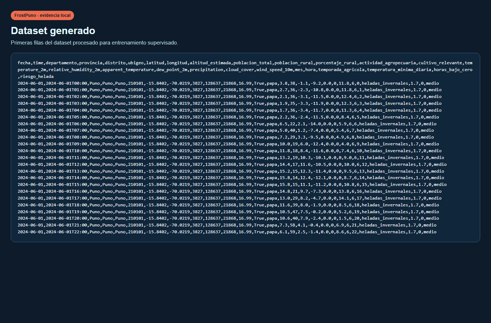

La evidencia muestra una vista del dataset procesado usado para entrenamiento. Este archivo consolida variables territoriales y climáticas, y sirve como base para la clasificación supervisada del riesgo de helada.

### Captura 03: Metadata del modelo

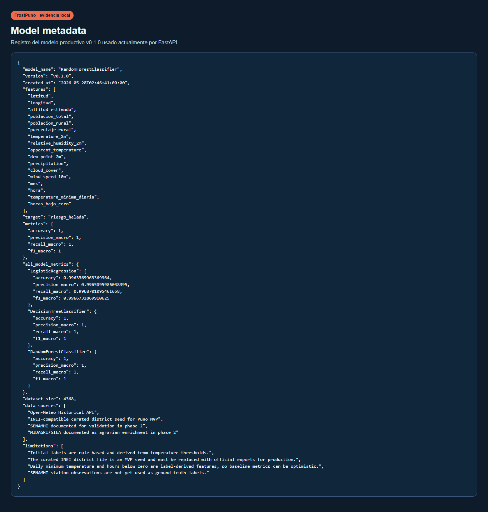

La captura muestra el archivo `model_metadata.json` generado por el registry del pipeline ML. Incluye versión del modelo, algoritmo seleccionado, métricas, tamaño del dataset, fuentes de datos y limitaciones documentadas.

### Captura 04: Quality gate aprobado

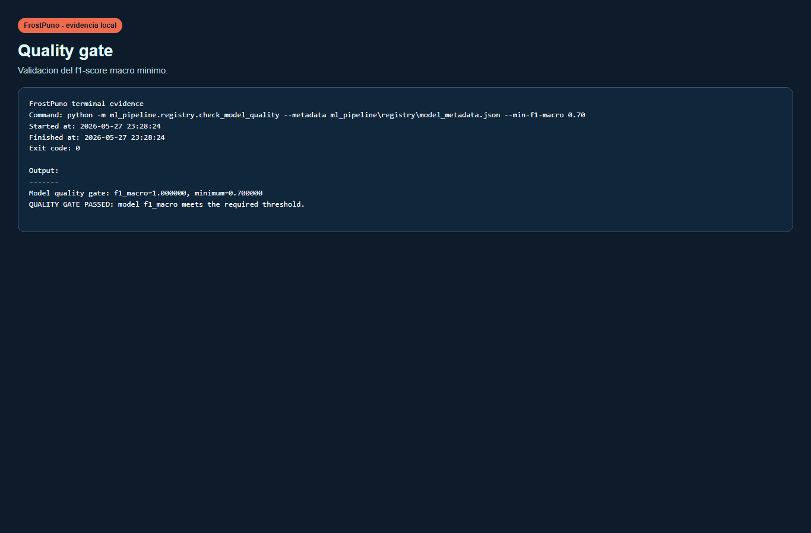

La evidencia muestra la validación del umbral mínimo de `f1-score macro`. Este control impide promover un modelo si no cumple el criterio básico de calidad definido para el MVP académico.

### Captura 05: FastAPI Swagger

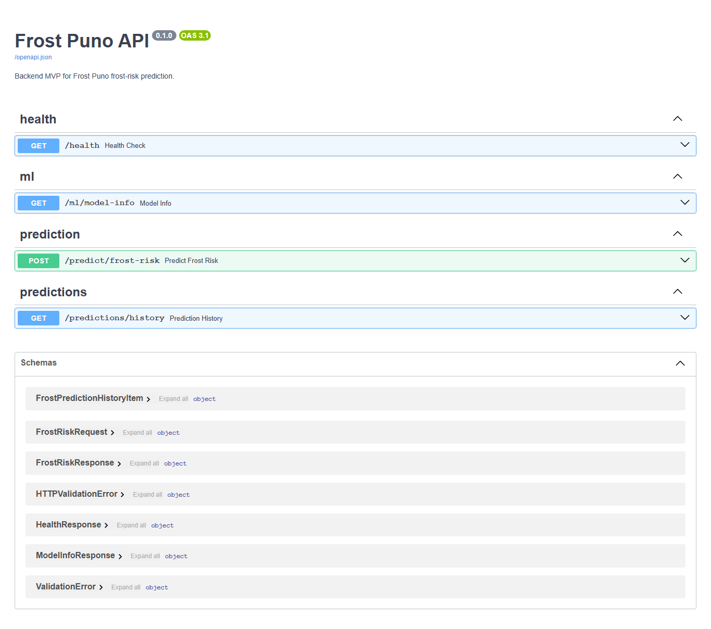

La captura presenta la documentación automática de FastAPI mediante Swagger UI. Se visualizan los endpoints principales del backend, lo cual facilita la validación técnica y la exposición controlada de la API.

### Captura 06: Endpoint de salud

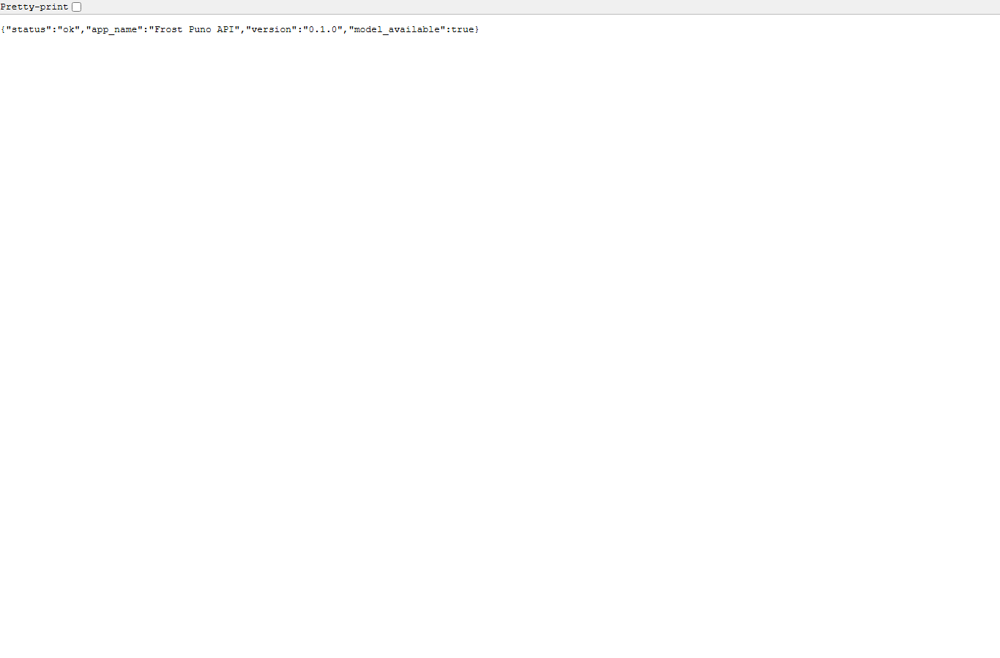

Esta evidencia muestra la respuesta de `GET /health`. El endpoint permite comprobar que el backend se encuentra operativo y que el modelo está disponible para atender predicciones.

### Captura 07: Endpoint de información del modelo

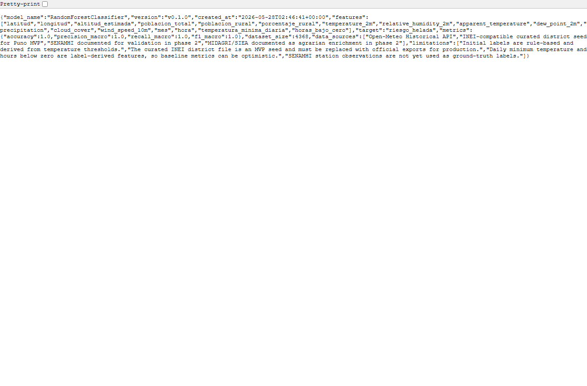

La captura muestra la respuesta de `GET /ml/model-info`. Este endpoint expone información técnica del modelo activo, su versión, métricas y fuentes de datos usadas.

### Captura 08: Endpoint de predicción

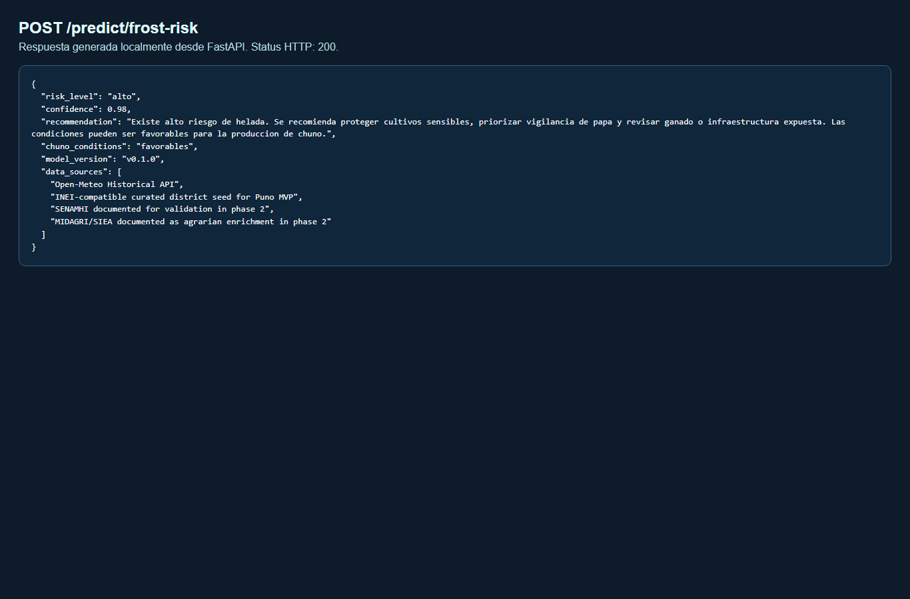

La evidencia muestra una respuesta JSON generada por `POST /predict/frost-risk`. Se observa el nivel de riesgo, la confianza, la recomendación, la condición para chuño, la versión del modelo y las fuentes asociadas.

### Captura 09: Tests backend

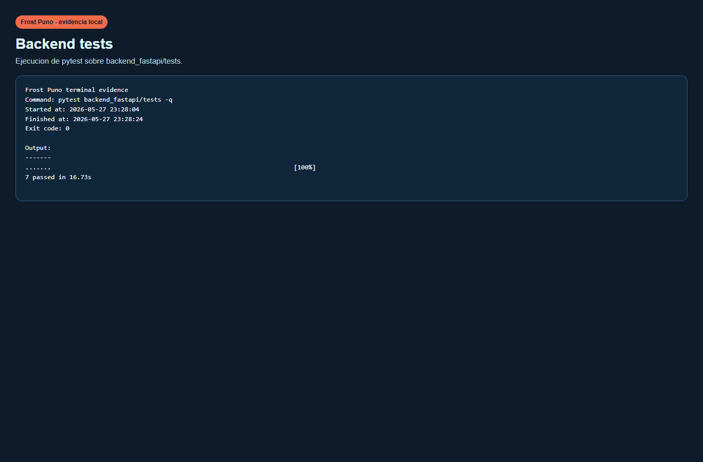

La captura documenta la ejecución de pruebas automatizadas del backend. Estas pruebas verifican endpoints principales, predicción, historial sin Supabase y comportamiento del repositorio NoOp.

### Captura 10: Flutter Home

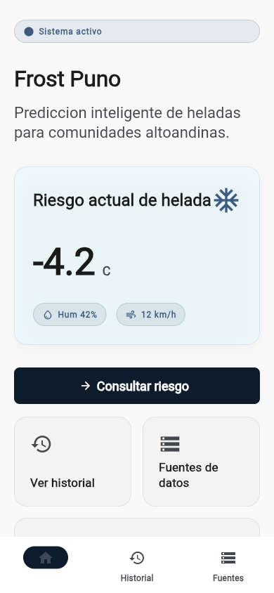

La evidencia presenta la pantalla inicial de Flutter Web. Se aprecia el estado del sistema, la tarjeta de riesgo actual, accesos rápidos y la estética visual inspirada en el diseño de Stitch.

### Captura 11: Formulario Flutter

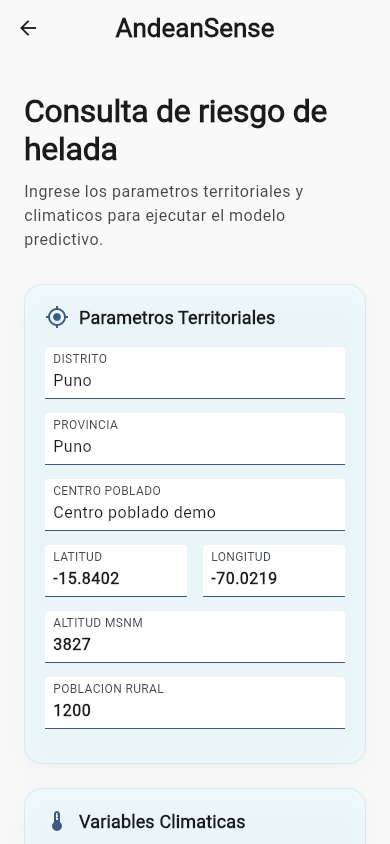

La captura muestra el formulario de consulta con datos demo precargados. Esta pantalla permite enviar parámetros territoriales y climáticos al backend FastAPI sin exponer credenciales de Supabase.

### Captura 12: Resultado de predicción

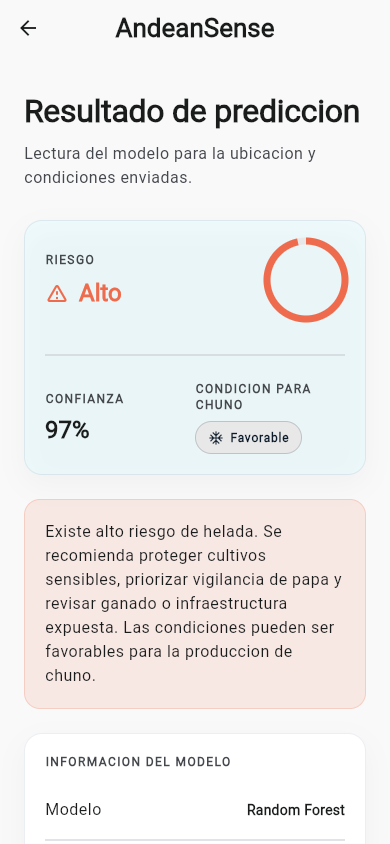

La evidencia muestra el resultado de predicción retornado por el backend. La interfaz comunica el nivel de riesgo, la confianza del modelo y una recomendación interpretativa para el usuario.

### Captura 13: Historial

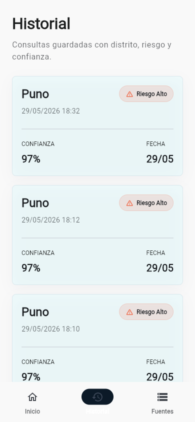

La captura presenta la pantalla de historial de predicciones. En modo MVP puede mostrarse una lista vacía si Supabase está desactivado, manteniendo el flujo preparado para persistencia real.

### Captura 14: Fuentes de datos

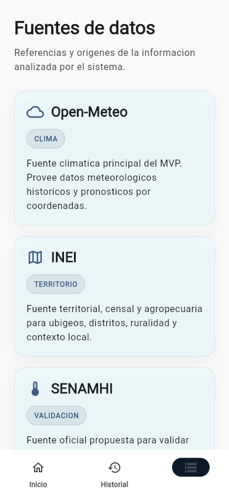

La evidencia muestra la pantalla de fuentes consideradas por el sistema. Se documenta el rol de Open-Meteo, INEI, SENAMHI y MIDAGRI/SIEA dentro de la arquitectura del MVP y fases futuras.

### Captura 15: Información del modelo en Flutter

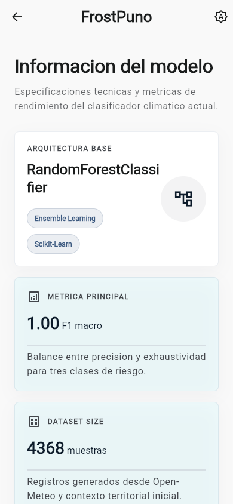

La captura muestra la pantalla Flutter que consume `GET /ml/model-info`. Permite evidenciar que el frontend obtiene información técnica del modelo únicamente a través del backend FastAPI.

### Captura 16: Flutter analyze y test

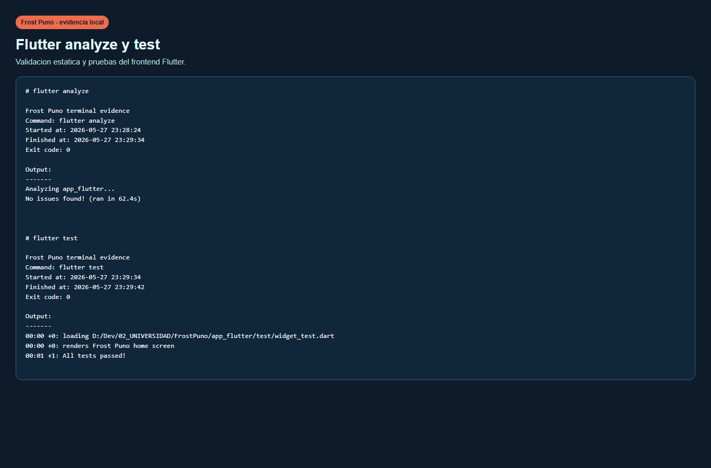

La evidencia registra la validación estática y pruebas del proyecto Flutter. Estos comandos respaldan que la interfaz se mantiene sin errores de análisis y con pruebas funcionales para el MVP.

### Captura 17: Flutter build web

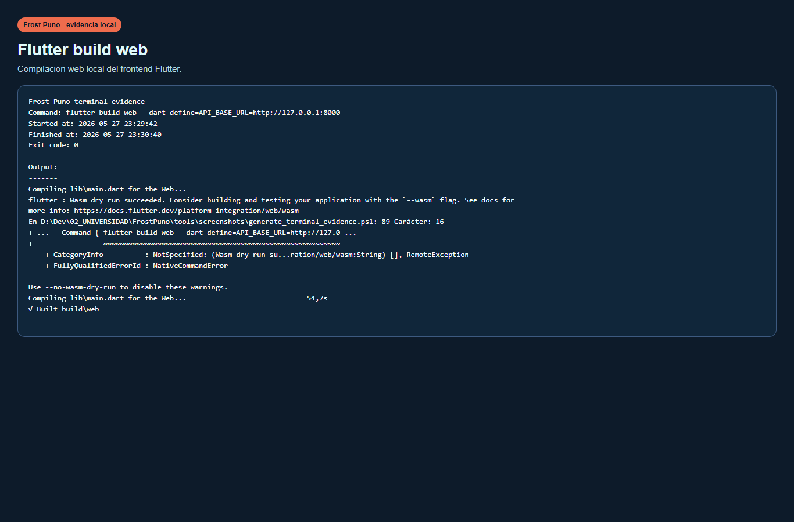

La captura muestra la compilación correcta de Flutter Web. Esto demuestra que el frontend está preparado para una demo local y para un despliegue posterior en una plataforma gratuita compatible.

### Captura 18: GitHub workflows


La evidencia muestra los workflows de GitHub Actions implementados. Estos archivos sustentan la automatización de pruebas, validación de datos, entrenamiento del modelo y control de calidad.

### Captura 19: Supabase SQL

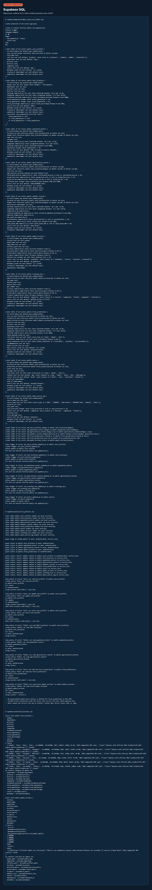

La captura presenta las migraciones, políticas RLS y datos semilla de Supabase. Esta evidencia respalda el diseño de persistencia, seguridad básica y preparación de la base de datos del MVP.

### Captura 20: Dataset v2 sin data leakage

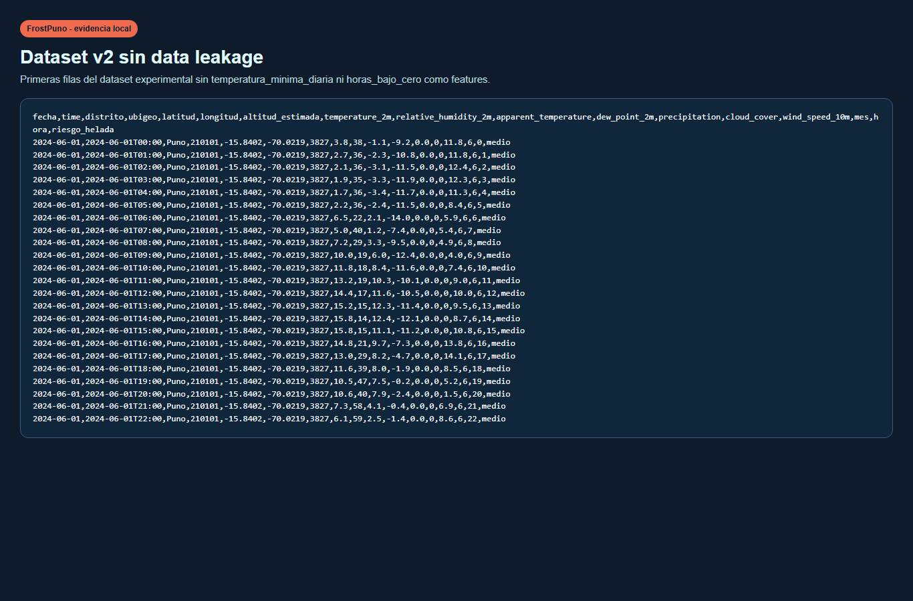

La evidencia muestra el dataset experimental `frost_training_dataset_v2.csv`, creado sin sobrescribir el dataset original. Este dataset elimina `temperatura_minima_diaria` y `horas_bajo_cero` como features para evitar data leakage.

### Captura 21: Metadata del modelo v0.2.0

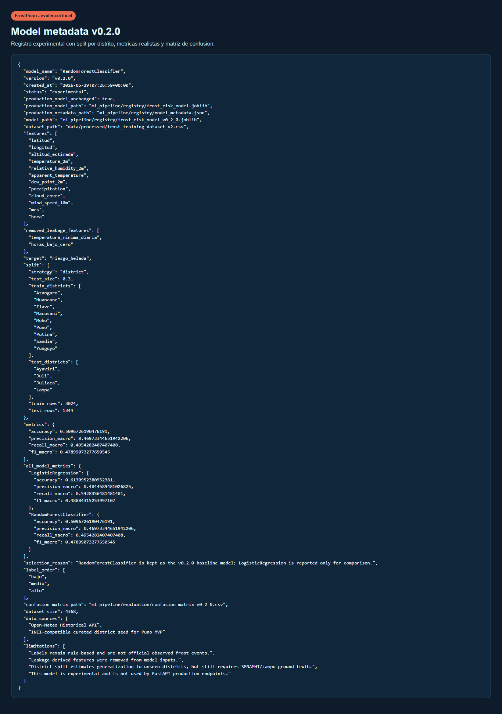

La captura muestra el registro experimental `model_metadata_v0_2_0.json`, con estrategia de split por distrito, métricas realistas, features usadas y trazabilidad del entrenamiento.

### Captura 22: Comparación formal v0.1.0 vs v0.2.0

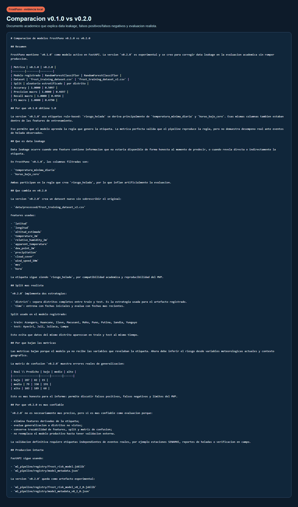

La evidencia documenta por qué `v0.1.0` alcanza métricas perfectas, qué columnas generaban data leakage, cómo se corrige en `v0.2.0` y por qué la nueva evaluación es más confiable aunque tenga menor F1 macro.

### Captura 23: Despliegue Render, Vercel y Supabase


La captura resume la guía de despliegue con backend FastAPI en Render, frontend Flutter Web en Vercel, base PostgreSQL en Supabase y validaciones end-to-end.

### Captura 24: Android APK y prueba móvil


La evidencia muestra los comandos para ejecutar en Android, usar GPS, configurar el backend remoto y generar el APK release.

### Captura 25: GitHub repositorio

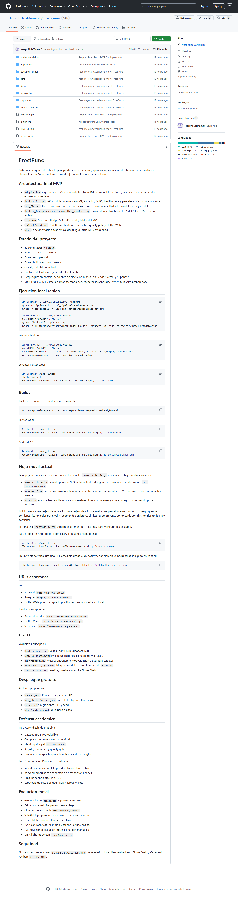

La captura muestra el repositorio público `JosephElvisMaman1/frost-puno`, base de trazabilidad para ramas, commits, CI/CD y despliegues.

### Captura 26: GitHub rama v0.2.0

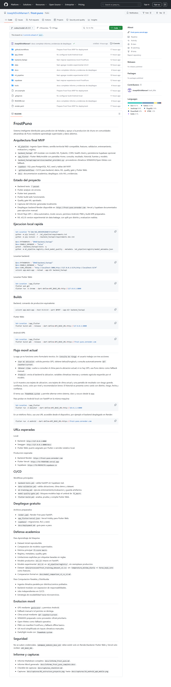

La evidencia muestra la rama `codex/model-v0-2-0`, donde se versionó el dataset sin leakage, el modelo experimental y el informe completo.

### Captura 27: GitHub commits v0.2.0

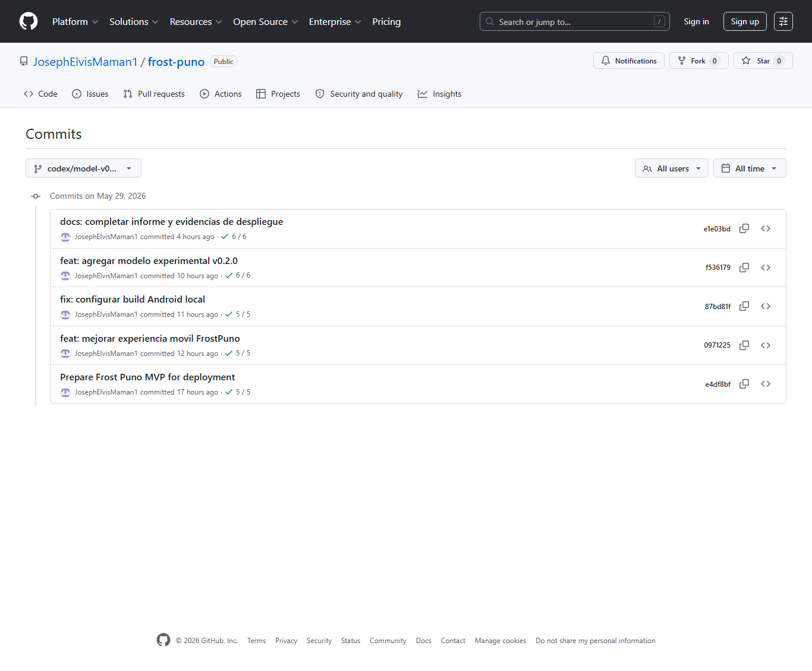

La captura documenta los commits principales de la rama: configuración Android, modelo experimental `v0.2.0` e informe/evidencias de despliegue.

### Captura 28: GitHub Actions


La evidencia muestra la sección Actions del repositorio, donde se ubican los workflows de backend, datos, ML, quality gate y Flutter Web.

### Captura 29: Render health remoto


La captura muestra `GET /health` del backend desplegado en Render, confirmando que FastAPI responde y que el modelo productivo está disponible.

### Captura 30: Render model-info remoto

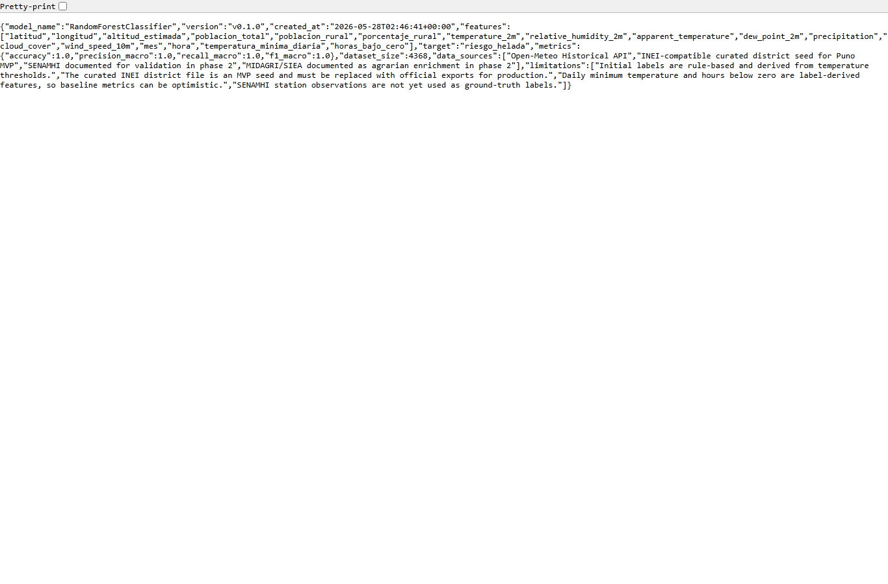

La evidencia muestra `GET /ml/model-info` desde Render. Permite verificar qué versión de modelo está activa en producción.

### Captura 31: Render Swagger remoto


La captura muestra Swagger UI en Render, evidencia de documentación interactiva de endpoints en el backend desplegado.

### Captura 32: Vercel Flutter móvil

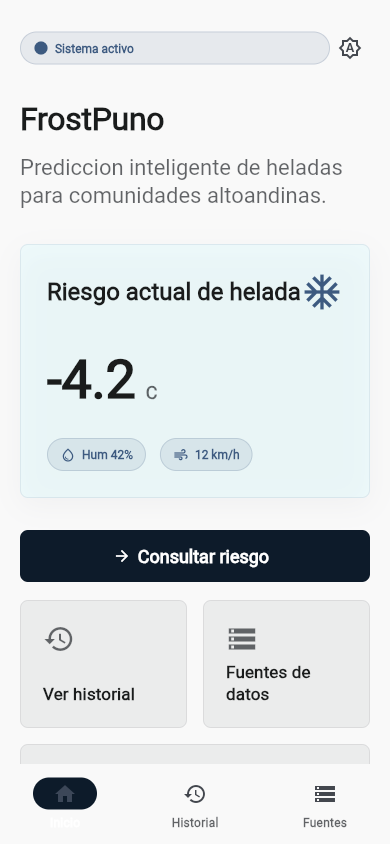

La evidencia muestra la app Flutter servida desde Vercel en viewport móvil, útil para validar que la interfaz sea usable en pantalla pequeña.

### Captura 33: Vercel Flutter desktop


La captura muestra la misma app publicada en Vercel en viewport desktop, confirmando despliegue web/PWA.

### Captura 34: Headers Render y Vercel

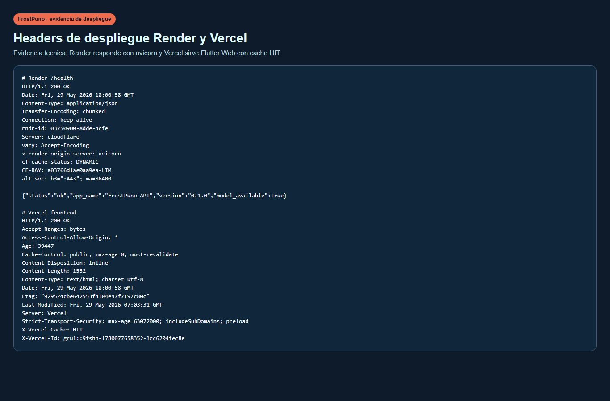

La evidencia registra headers HTTP: Render responde desde `uvicorn` y Vercel sirve el frontend con infraestructura propia.

### Captura 35: Ramas y versiones

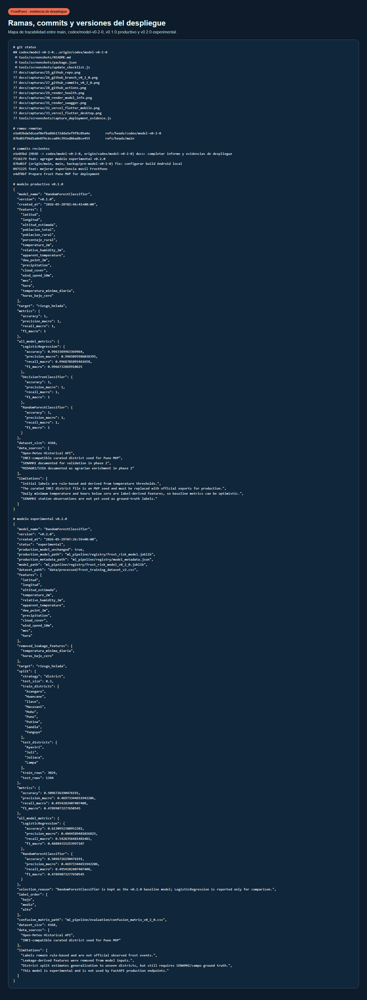

La captura consolida ramas remotas, commits recientes y metadata de modelos `v0.1.0` y `v0.2.0`.

### Captura 36: Supabase estado y esquema

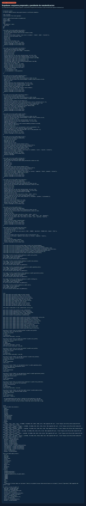

La evidencia muestra que el esquema Supabase está versionado mediante SQL, junto con la nota técnica de que el conector privado requería reautenticación para capturar el dashboard real.

### Captura 37: Vercel estado y configuración

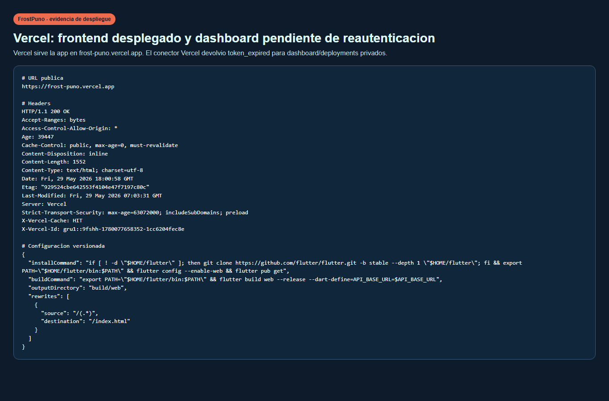

La captura registra la URL pública de Vercel, headers de despliegue y `app_flutter/vercel.json`.

---

## 20. Resultados obtenidos

Los resultados del MVP son:

- 13 distritos procesados.
- 4,368 filas horarias climáticas generadas desde Open-Meteo.
- Distribución de clases:
  - alto = 1704;
  - medio = 1512;
  - bajo = 1152.
- Mejor modelo registrado: RandomForestClassifier.
- Quality gate aprobado.
- Backend tests: 7 passed.
- Flutter analyze: sin errores.
- Flutter test: passed.
- Flutter build web: correcto.
- Backend FastAPI funcional con endpoints mínimos.
- Supabase preparado con migraciones, seed y RLS.
- Aplicación Flutter implementada con diseño inspirado en Stitch.
- Aplicación móvil simplificada con GPS, clima automático, modo oscuro, historial visual y resultado comprensible.
- Backend desplegable en Render y configurado para consumir desde Flutter Web/Android.
- Guía de Vercel, Supabase, GitHub Actions y APK documentada.
- Dataset `v0.2.0` creado sin data leakage.
- Modelo experimental `v0.2.0` entrenado y registrado sin modificar producción.
- Evaluación realista por distrito con F1 macro `0.4790`.
- Comparación formal `v0.1.0` vs `v0.2.0` documentada.
- Capturas remotas de GitHub, Render y Vercel generadas.
- Configuración de despliegue separada para `v0.2.0` mediante `render.v2.yaml`.
- Icono propio de APK/PWA agregado.
- Flujo de mejora supervisada con observaciones tipo SENAMHI/campo agregado.
- Supabase preparado para feedback y observaciones oficiales.

---

## 21. Recomendaciones de mejora

1. Reautenticar conectores GitHub, Vercel y Supabase para capturar dashboards privados directamente desde el navegador o MCP.
2. Crear un servicio Render separado `frost-puno-api-v2` usando `render.v2.yaml`, rama `codex/model-v0-2-0` y `autoDeploy=false`.
3. Agregar un selector interno o endpoint `/ml/model-info-v2` solo para demo académica, sin cambiar la predicción productiva.
4. Validar `v0.2.0` con datos independientes de SENAMHI o reportes de campo antes de promoverlo.
5. Configurar Supabase real con `ENABLE_SUPABASE=true` solo después de verificar RLS, service role en Render y que Flutter no tenga claves privadas.
6. Conectar Vercel a la rama `main` para producción y a `codex/model-v0-2-0` como preview, documentando ambas URLs.
7. Agregar monitoreo básico: latencia de Render, errores de `/predict/frost-risk`, tasa de permisos GPS denegados y registros de predicción.
8. Reemplazar el archivo de muestra SENAMHI por observaciones oficiales completas y recalcular `senamhi_observation_evaluation_v0_2_0.json`.

---

## 22. Limitaciones

1. INEI se usa mediante una semilla curada MVP, no mediante extracción oficial completa automática.
2. SENAMHI aún no está integrado como extracción oficial automática completa; sin embargo, ya existe un contrato de observaciones y un script de evaluación externa.
3. Las etiquetas iniciales se generan con reglas térmicas, no con observaciones de daño agrícola; la nueva ruta de feedback/observaciones permite reemplazar progresivamente esa limitación.
4. El dataset inicial tiene cobertura temporal y territorial limitada.
5. Las métricas `v0.1.0` son optimistas por el uso de variables derivadas de la regla de etiquetado.
6. Render, Vercel y Supabase free tier tienen límites de disponibilidad, almacenamiento y ejecución.
7. El MVP no reemplaza sistemas oficiales de alerta meteorológica ni recomendaciones técnicas institucionales.
8. La versión `v0.2.0` mejora la evaluación, pero aún usa una etiqueta rule-based; falta validación con eventos reales.

### 22.1 Limitaciones mitigadas en esta iteración

- Métrica perfecta `v0.1.0`: mitigada con `v0.2.0`, eliminación de leakage y split por distrito.
- SENAMHI: mitigada parcialmente con `data/validation/senamhi_frost_observations_sample.csv` y `evaluate_observed_events.py`.
- Daño agrícola observado: mitigado parcialmente con tablas Supabase para feedback y observaciones.
- App móvil: mejorada con icono APK/PWA propio y tarjeta de mejora supervisada.

La mitigación no significa que el problema esté cerrado para producción. Significa que el proyecto ya tiene una ruta técnica clara para resolverlo con datos oficiales.

---

## 23. Trabajos futuros

1. Integrar datos SENAMHI de estaciones y avisos de helada.
2. Reemplazar la semilla INEI por exportaciones oficiales completas.
3. Integrar MIDAGRI/SIEA para cultivos, superficie, producción y rendimiento.
4. Implementar mapa interactivo por distrito o centro poblado.
5. Agregar alertas push con Firebase Cloud Messaging.
6. Crear dashboard administrativo.
7. Implementar modo offline para comunidades con conectividad limitada.
8. Desplegar completamente en Vercel, Render y Supabase.
9. Validar predicciones con productores locales y especialistas.
10. Incorporar monitoreo de deriva de datos y comparación automática con modelo activo anterior.

### 23.1 Evolución móvil y climática planificada

La versión evolucionada de FrostPuno incorpora preparación para uso móvil mediante geolocalización, permisos Android, PWA y generación de APK. El sistema añade un contrato de proveedores climáticos donde SENAMHI se considera fuente oficial peruana prioritaria, mientras Open-Meteo permanece como fuente de respaldo cuando no hay acceso operativo estable a datos oficiales en tiempo real.

Esta mejora no cambia la limitación central del MVP: la validación oficial completa con estaciones SENAMHI y trabajo de campo sigue pendiente. Por ello, los datos consultados por fallback deben interpretarse como soporte técnico para demostración y no como reemplazo de alertas oficiales.

---

## 24. Conclusiones

1. FrostPuno demuestra la viabilidad de integrar datos abiertos, aprendizaje supervisado y arquitectura distribuida para estimar riesgo de heladas en un contexto regional altoandino.
2. Desde Aprendizaje de Máquina, el proyecto implementa un ciclo completo: dataset, features, entrenamiento, evaluación, registro de modelo y quality gate.
3. Desde Computación Paralela y Distribuida, el sistema evidencia procesamiento concurrente por ubicaciones, separación modular de responsabilidades y automatización mediante jobs independientes.
4. La métrica perfecta de `v0.1.0` no demuestra predicción perfecta de heladas reales; evidencia aprendizaje de una regla con data leakage.
5. La versión `v0.2.0` ofrece una evaluación más realista al eliminar features filtradas y separar distritos entre entrenamiento y prueba.
6. El uso de RandomForestClassifier resulta adecuado para el MVP por su desempeño en datos tabulares y bajo costo computacional.
7. La arquitectura modular monolítica del backend es una decisión apropiada para un proyecto universitario, ya que reduce complejidad sin impedir escalabilidad futura.
8. La aplicación Flutter permite mostrar el sistema de manera visual, clara y preparada para web/móvil, sin exponer credenciales sensibles.
9. Las limitaciones del dataset y las etiquetas iniciales deben ser reconocidas explícitamente; el valor académico del sistema está en su arquitectura, trazabilidad y capacidad de mejora.

---

## 25. Bibliografía

FastAPI. (2026). *FastAPI documentation*. https://fastapi.tiangolo.com/

Flutter. (2026). *Build and release a web app*. https://docs.flutter.dev/deployment/web

GitHub. (2026). *Workflow syntax for GitHub Actions*. https://docs.github.com/actions/reference/workflows-and-actions/workflow-syntax

Google. (2026). *Stitch*. https://stitch.withgoogle.com/  
Nota: usado como referencia conceptual de diseño visual cuando corresponda.

Instituto Nacional de Estadística e Informática. (2025). *Consultar datos en el Sistema de Información Distrital del INEI*. Plataforma del Estado Peruano. https://www.gob.pe/institucion/inei/pages/27392-consultar-datos-en-el-sistema-de-informacion-distrital-del-inei

Ministerio de Desarrollo Agrario y Riego. (2026). *Compendio anual de Producción Agrícola*. Plataforma del Estado Peruano. https://www.gob.pe/institucion/midagri/informes-publicaciones/2730325-compendio-anual-de-produccion-agricola

Open-Meteo. (2026). *Historical Weather API*. https://open-meteo.com/en/docs/historical-weather-api

Scikit-learn. (2026). *sklearn.ensemble: RandomForestClassifier*. https://scikit-learn.org/stable/api/sklearn.ensemble.html

Servicio Nacional de Meteorología e Hidrología del Perú. (2026). *Descarga de datos*. https://www.senamhi.gob.pe/site/descarga-datos/?p=sedes

Supabase. (2026). *Row Level Security*. https://supabase.com/docs/guides/database/postgres/row-level-security

Supabase. (2026). *Securing your API*. https://supabase.com/docs/guides/api/securing-your-api

---

## 26. Anexos

### 26.1 Comandos de ejecución

#### Backend FastAPI

```powershell
Set-Location "D:\Dev\02_UNIVERSIDAD\FrostPuno"
$env:PYTHONPATH = "D:\Dev\02_UNIVERSIDAD\FrostPuno\backend_fastapi"
uvicorn app.main:app --reload --app-dir backend_fastapi
```

#### Flutter Web

```powershell
Set-Location "D:\Dev\02_UNIVERSIDAD\FrostPuno\app_flutter"
flutter run -d chrome --dart-define=API_BASE_URL=http://127.0.0.1:8000
```

#### Pipeline ML

```powershell
python -m ml_pipeline.data_ingestion.ingest_locations
python -m ml_pipeline.data_ingestion.ingest_weather_open_meteo --start-date 2024-06-01 --end-date 2024-06-14 --max-workers 4
python -m ml_pipeline.features.build_features
python -m ml_pipeline.preprocessing.validate_dataset
python -m ml_pipeline.training.train_models --version v0.1.0
python -m ml_pipeline.evaluation.evaluate_model
python -m ml_pipeline.registry.check_model_quality --metadata ml_pipeline\registry\model_metadata.json --min-f1-macro 0.70
```

### 26.2 Estructura de carpetas

```text
FrostPuno/
  app_flutter/
  backend_fastapi/
  data/
  docs/
  ml_pipeline/
  supabase/
  .github/workflows/
```

### 26.3 Ejemplo JSON de predicción

```json
{
  "district": "Puno",
  "province": "Puno",
  "populated_center": "Centro poblado demo",
  "latitude": -15.8402,
  "longitude": -70.0219,
  "altitude": 3827,
  "rural_population": 1200,
  "agricultural_activity": true,
  "main_crop": "papa",
  "temperature_min": -2.5,
  "temperature_max": 12.4,
  "feels_like": -4.0,
  "humidity": 68,
  "wind_speed": 7,
  "cloud_cover": 20,
  "dew_point": -3.5,
  "precipitation": 0,
  "month": 6,
  "hour": 3,
  "hours_below_zero": 4
}
```

### 26.4 Comandos del modelo experimental v0.2.0

```powershell
python -m ml_pipeline.features.build_features_v2
python -m ml_pipeline.training.train_models_v2 --version v0.2.0 --split-strategy district
pytest ml_pipeline\tests -q
```

Artefactos generados:

```text
data/processed/frost_training_dataset_v2.csv
ml_pipeline/registry/frost_risk_model_v0_2_0.joblib
ml_pipeline/registry/model_metadata_v0_2_0.json
ml_pipeline/evaluation/confusion_matrix_v0_2_0.csv
ml_pipeline/evaluation/metrics_comparison_v0_2_0.json
```

### 26.5 Comandos de mejora supervisada

```powershell
python -m ml_pipeline.evaluation.evaluate_observed_events
```

Archivos relacionados:

```text
data/validation/senamhi_frost_observations_sample.csv
ml_pipeline/evaluation/senamhi_observation_evaluation_v0_2_0.json
supabase/migrations/002_add_feedback_and_observations.sql
```

Metricas de muestra:

```text
accuracy = 0.6000
precision_macro = 0.3889
recall_macro = 0.5000
f1_macro = 0.4333
```

Estas metricas son demostrativas porque el archivo de observaciones es pequeño. El objetivo es probar el mecanismo de mejora supervisada.

### 26.6 Checklist de despliegue futuro

- [ ] Crear proyecto Supabase.
- [ ] Ejecutar migraciones SQL.
- [ ] Configurar RLS y seed.
- [ ] Configurar variables backend en Render.
- [ ] Configurar API URL en Flutter Web.
- [ ] Desplegar Flutter Web en Vercel.
- [ ] Configurar GitHub Actions.
- [ ] Ejecutar quality gate.
- [ ] Validar Swagger en entorno remoto.
- [ ] Validar predicción desde Flutter Web.
- [ ] Verificar que no existan claves Supabase en frontend.
